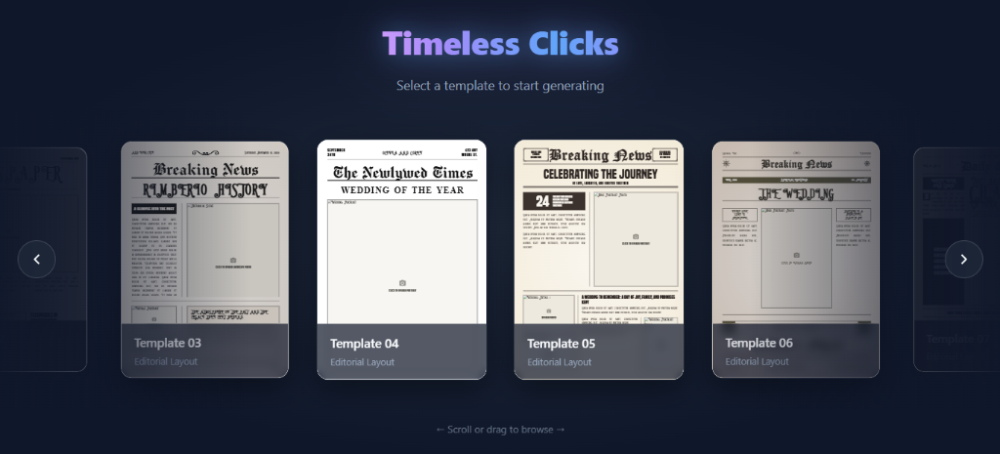
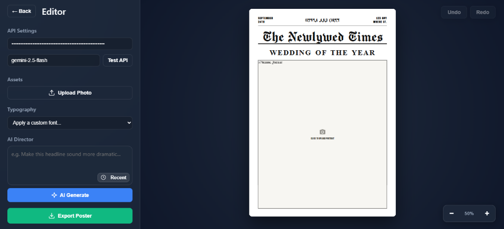

# Timeless Clicks Editor

Welcome to the **Timeless Clicks Editor**! This is an AI-powered web application that allows you to effortlessly design, edit, and export beautiful A4 posters and invitations. With built-in AI assistance powered by Google Gemini, you can automatically rewrite, format, and fit your text directly into the layout without breaking the design.

## Features

- **Direct Text Editing:** Click any text block to edit it directly.
- **Image Uploads:** Click any image or placeholder to upload and replace it with your own photos.
- **AI Director:** Select a text block and ask the AI to "make it sound more romantic" or "shorten it." The AI will automatically rewrite the text and perfectly fit it into the physical boundaries of the template.
- **Typography Controls:** Change the font style of specific text blocks or apply a global font to the entire poster with one click.
- **Export to PNG:** Once you are happy with your design, export it as a high-quality PNG image ready for printing.

## Prerequisites

Before running the application, make sure you have the following installed on your computer:

- **Node.js** (v18 or higher recommended)
- **npm** (comes with Node.js)

You will also need a **Google Gemini API Key** to use the AI features. You can get one for free from Google AI Studio.

## How to Run the Application

1. **Open a terminal (Command Prompt or PowerShell).**
2. **Navigate to the project folder:**

   ```bash
   cd "path/to/timeless clicks/editor-app"
   ```

3. **Install the required dependencies** (you only need to do this the first time):

   ```bash
   npm install
   ```

4. **Start the development server:**

   ```bash
   npm run dev
   ```

5. **Open your web browser** and go to the local address provided in the terminal (usually `http://localhost:5173`).




## How to Use the Editor

### 1. Set Up the AI (One-time setup)

When you first open the editor, look at the left sidebar under **API Settings**. Paste your Gemini API Key into the input box. The app will save it securely in your browser for future visits. You can also test the connection by clicking "Test API".

### 2. Editing Text and Images

- **To edit text:** Simply click on any text (it will highlight with a blue border) and start typing on your keyboard.
- **To change an image:** Click on the image you want to replace. A file browser will pop up allowing you to select a new photo from your computer.

### 3. Changing Fonts

- Select a text block and pick a font from the **Typography** dropdown to change just that block.
- **Click anywhere on the dark background** (so nothing is highlighted) and pick a font from the dropdown. This will instantly change the font style for the **entire template**.

### 4. Using the AI Director

- Select a text block.
- In the left sidebar under **AI Director**, type a prompt like *"Rewrite this to be shorter and punchier"* and click the submit button.
- The AI will rewrite your text and automatically shrink or scale the font so it fits perfectly inside your layout without pushing other elements around.

### 5. Exporting

When you are completely finished, look for the **Export** button (usually in the toolbar or sidebar). Click it, and your browser will download a high-resolution PNG file of your poster.

## Tech Stack

- **React 19**
- **Vite**
- **Google Generative AI (Gemini)**
- **html2canvas** (for exporting)
